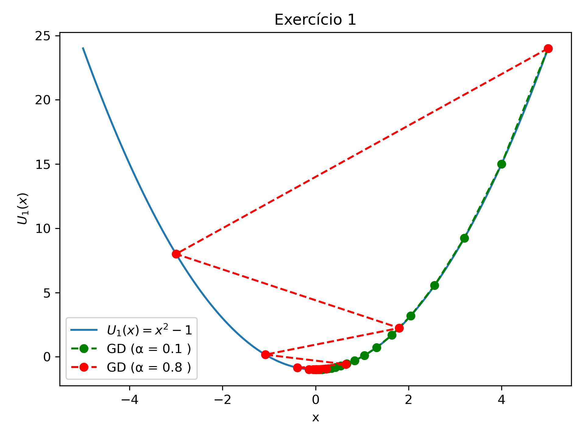
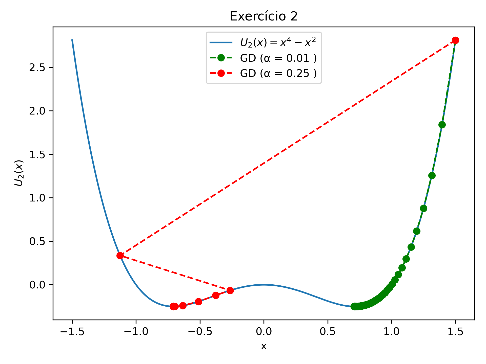
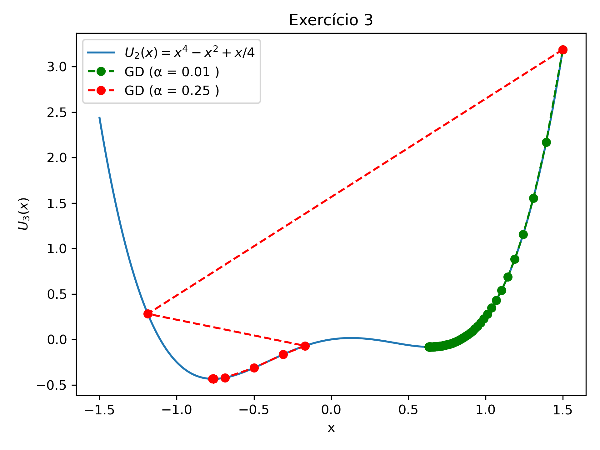
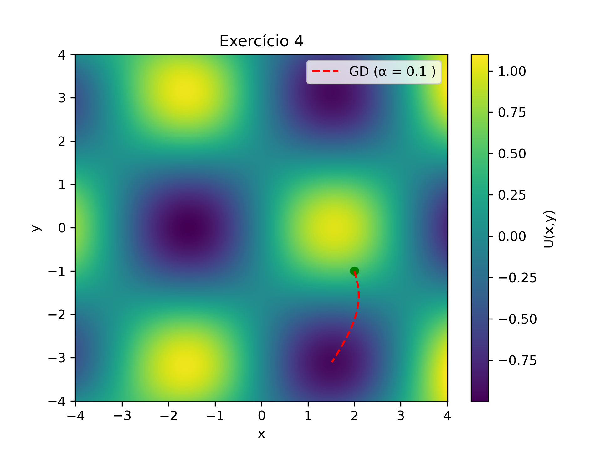
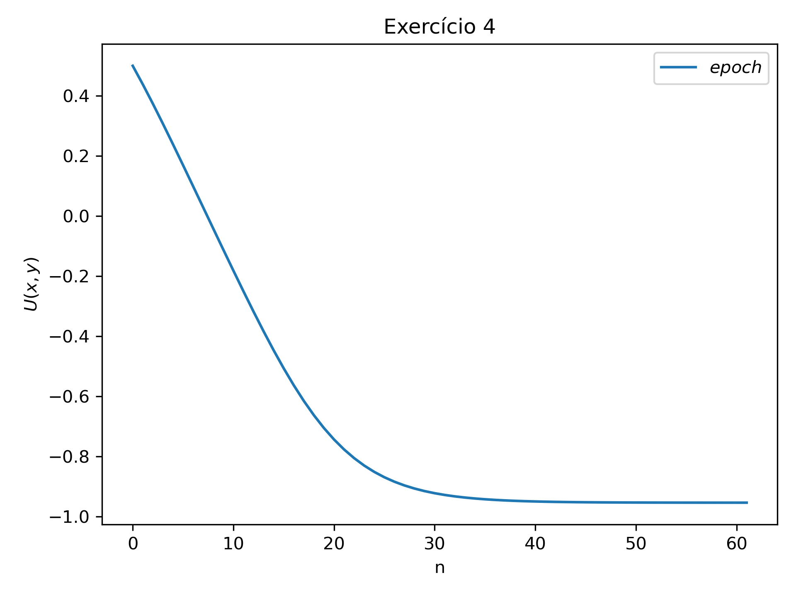

# Atividade 1

## Gradiente descendente

O método do **gradiente descendente** é um algoritmo de otimização utilizado para minimizar funções. Ele é amplamente utilizado em aprendizado de máquina e redes neurais para ajustar os pesos e vieses de um modelo. 
O algoritmo é muito parecido com a dinâmica de uma partícula se movendo em um potencial e sujeita a muito atrito. E a variação da posição da partícula é dada por:

$$
\Delta \vec{r} = \frac{1}{2} \vec{a} \Delta t^2 = -\alpha \nabla U(\vec{r})
$$

Sendo $\alpha$ a **taxa de aprendizado**, pois determina o tamanho do passo que daremos na direção do gradiente. 

A partir disso, resolvemos 4 exercícios diferentes para aplicar esse método e entender o seu funcionamento. Os códigos em Python desenvolvidos para solucionar os problemas são:

[Exercicios 1, 2 e 3](Exercicio_GD_123.py)

[Exercicio 4](Exercicio_GD_4.py)

## Exercício 1

Implemente o algoritmo de gradiente descendente para encontrar o mínimo da função $U(x) = x^2 -1$. É um caso bem simples para o qual sabemos a solução exata. Ilustre o algoritimo com um gráfico mostrando a função $U(x)$ e a trajetória da partícula. Use inicialmente uma taxa de aprendizado $\alpha = 0.1$ e uma tolerância $\epsilon = 0.01$. O número máximo de iterações deve ser 1000. A posição inicial da partícula deve ser $x_ {0} = 5$. Depois, varie estes parâmetros para ver como eles afetam a convergência do algoritmo.

## Exercício 2

Repita o exercício 1 para a função $U(x) = x^2 (x-1)(x+1)$. Esta função tem dois mínimos globais. Use $x_ {0} = 2$ e tente ajustar $\alpha$ para tentar fazer o código convergir ora num mínimo, ora no outro. O que acontece? O que você pode concluir sobre a escolha da taxa de aprendizado $\alpha$?

_**R:** Dependendo da taxa de aprendizado_ $\alpha$ _que escolho, o resultado pode convergir tanto para um como para o outro mínimo global da função._

## Exercício 3

Repita o exercício 2, mas agora vamos manipular a altura dos mínimos somando uma reta em $U(x)$, tal que a função agora é $U(x) = x^2 (x-1)(x+1) + x/4$. O que acontece? O que você pode concluir sobre a escolha da taxa de aprendizado $\alpha$?

_**R:** Dependendo da taxa de aprendizado_ $\alpha$ _que escolho, o resultado pode convergir para o mínimo local da função, e não para o mínimo global._

## Exercício 4

Considere agora uma função bidimensional $U(\vec{r}) = U(x,y) = \sin(x)\cos(y) + 2 (xy)^2/1000$. A função tem multiplos mínimos locais. A vizualiação 3D dos passos neste caso pode ser dificil de interpretar. Então, neste caso, para acompanhar a evolução do algoritmo, faça dois gráficos:

a. Um gráfico de contorno (use `plt.imshow` ou `plt.pcolormesh`) da função $U(x,y)$ e desenhe a trajetória da partícula no gráfico.

b. Faça um gráfico do valor de $U(x_ {n}, r_ {n})$ a cada passo como função das iterações (passos) $n$. No contexto de redes neurais chamaremos estes passos de **epochs**.

Varie a posição inicial $(x_ {0}, y_ {0})$ e a taxa de aprendizado $\alpha$ e veja como isso afeta a convergência do algoritmo. O que acontece se você aumentar muito a taxa de aprendizado? E se você diminuir muito? Você consegue atingir o mínimo global?

_**R:** Se aumentarmos muito ou diminuirmos muito a taxa de aprendizado_ $\alpha$ _, o resultado não converge para o mínimo da função, pois os passos podem ficar muito grandes ou muito pequenos e, como delimitamos o número máximo de iterações em n=1000, pode ser que essa quantidade de iterações não seja suficiente._
