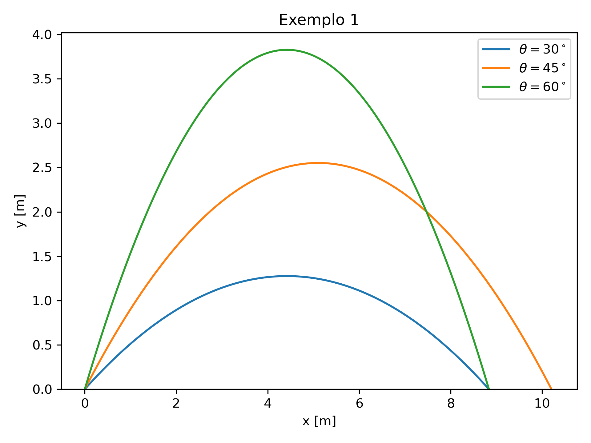

# Atividade 2

## Orientação a objetos

Orientação a Objetos em Python é um paradigma de programação que organiza o código em objetos, que são combinações de dados (variáveis) e comportamentos (funções/métodos). Em vez de só escrever funções soltas e variáveis, criamos classes que funcionam como “modelos” para criar objetos que representam coisas do mundo real ou lógicas de programas.

Nesta atividade, vamos explorar esses fundamentos e criar uma classe chamada `particula` que representa uma partícula em um espaço bidimensional. A classe deve ter os seguintes atributos:
  - `x`: coordenada x da partícula
  - `y`: coordenada y da partícula
  - `vx`: velocidade na direção x
  - `vy`: velocidade na direção y
  - `massa`: massa da partícula

E os seguintes métodos:
  - `__init__(self, x, y, vx, vy, massa)`: construtor da classe que inicializa os atributos da partícula.
  - `newton(self, fx, fy, dt)`: aplica a segunda lei de Newton para atualizar a velocidade e a posição da partícula com base nas forças `(fx, fy)` aplicadas e no intervalo de tempo `dt`. Considerar que a força é constante durante o intervalo de tempo `dt`.

Essa classe foi implementada no arquivo [particula.py](particula.py)

## Exemplo 1: lançamento oblíquo

Neste exemplo, criamos uma partícula inicialmente na posição (x,y) = (0,0), com velocidade inicial de 10 m/s e massa m = 1 kg. Consideramos apenas a força da gravidade, (fx, fy) = (0, -9.8) N. A cada dt = 0.01 s, aplicamos a força da gravidade, atualizamos a posição e velocidade da partícula e salvamos esses dados em listas para posterior plotagem. O loop é interrompido quando a partícula atinge o solo (y <= 0). 
Variamos o ângulo de lançamento da partícula e plotamos os gráficos das trajetórias. O resultado está na imagem abaixo:

Pela imagem, concluimos que o alcance máximo da partícula se dá com o ângulo de lançamento de 45°. O código desenvolvido para esse problema está em [Exemplo01.py](Exemplo01.py)

## Exemplo 2: 
