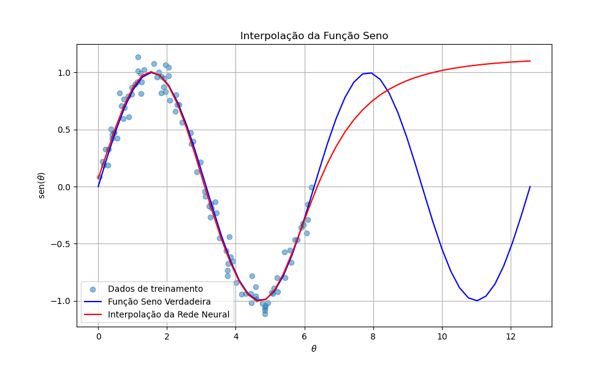

# Atividade 3

## Redes Neurais

Nesta atividade, utilizamos as bibliotecas **Scikit-learn** e **Pytorch** para treinar uma rede neural a aprender a interpolar funções básicas. O objetivo principal é aprender a usar essas ferramentas e entender como as variações dos parâmetros afetam os resultados.

## Usando Scikit-learn

Primeiramente, desenvolvemos um código utilizando a biblioteca Scikit-learn para interpolar uma função seno no intervalo de 0 a 2π. Em todos os casos, usamos MSE para a fução de perda (loss), otimizador Adam e funções de ativação `tanh`. Variamos o número de camadas ocultas e neurônios por camada e obtivemos os seguintes resultados:

 * Rede Neural com 1 camada oculta de 3 neurônios:

 * Rede Neural com 3 camadas ocultas de 10 neurônios:

Observamos então que, conforme aumentamos o número de camadas e de neurônios, os resultados são mais assertivos. Nesse caso, utilizamos 100 amostras de treinamento. Se utilizarmos poucas amostras para treinar o modelo, o resultado também fica mais discrepante que o esperado, como podemos ver na imagem abaixo:

 * Rede Neural treinada com apenas 10 amostras:

Entretanto, cabe ressaltar que o excesso de parâmetros pode levar a um overfitting do modelo. 

Depois, treinamos a Rede Neural para interpolar outras funções para ver como isso afetaria os resultados, e percebemos que funções mais complexas, como sync(x) = sin(x)/x, são mais difíceis de interpolar, utilizando os mesmos parâmetros e os mesmos números de camadas ocultas e neurônios. Os exemplos abaixo também foram treinados com 100 amostras, com um modelo de 3 camadas ocultas de 10 neurônios, num intervalo de -10 a 10.

 * Interpolação da função sync(x) = sin(x)/x:

 * Interpolaçao da função gaussiana $e^{-x^2}$:

Por fim, extrapolamos nosso intervalo de validação para ver como a Rede Neural se comportaria, e, em todos os casos, ela não conseguiu prever o resultado fora do intervalo de treinamento. Ou seja, ela não conseguiu prever o futuro. Esse comportamento é mostrado na imagem abaixo, onde treinamos a rede no intervalo de 0 a 2π, e pedimos para ela interpolar a função seno no intervalo de 0 a 4π.

 * Extrapolação do intervalo de treinamento:

Todos esses gráficos e análises foram feitos a partir dos códigos: [Seno Sklearn](sin-sklearn.py) e [Sync/Gauss Sklearn](sync-gaus-sklearn.py).

## Usando Pytorch

Também desenvolvemos um código utilizando Pytorch para treinar a rede neural a interpolar uma função seno, da mesma forma que fizemos utilizando Sklearn, apenas para fins didáticos. O objetivo era comparar os modelos e se habituar com esse tipo de biblioteca. O resultado foi o seguinte:

 * Rede Neural com 3 camadas ocultas de 10 neurônios:

O código desenvolvido para esse modelo é: [Seno Pytorch](sin-pytorch.py)

## Treinando derivadas

Nesse exercício, treinamos uma Rede Neural (via Scikit-learn) para calcular derivadas numéricas. Para isso, usamos como input 50 valores de x (entre -1 e 1), os correspondentes valores de 10000 polinômios aleatórios de grau máximo 9, e as respectivas derivadas. O objetivo final era testar o modelo para calcular a derivada de funções trigonométricas, sendo treinado apenas com polinômios. Obtivemos o seguinte resultado:

 * Treinamento inicial:

Depois disso, visando melhorar o resultado, refinamos nossos dados de entrada e treinamos nosso modelo só com polinômios aleatórios de graus ímpares e de graus pares (para se aproximar um pouco de uma expansão de Taylor). O resultado final foi o seguinte:

 * Refinando os dados de treinamento:

Observamos uma melhora considerável nos resultados. Para esse exercício, desenvolvemos o código: [Derivadas Sklearn](sklearn-derivadas.py)

