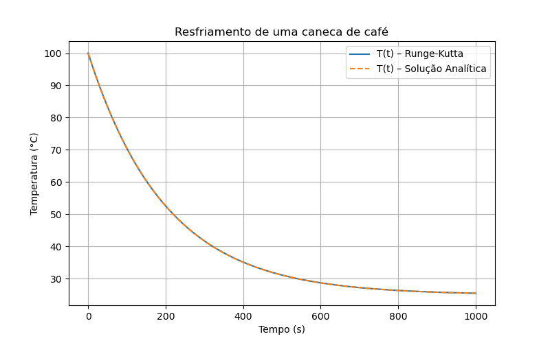
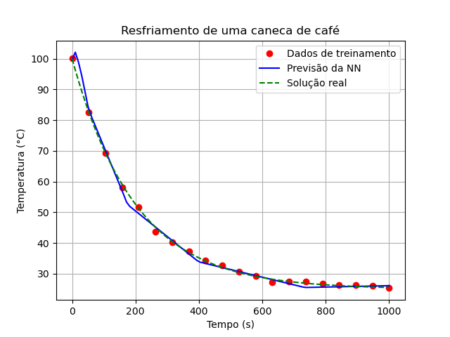
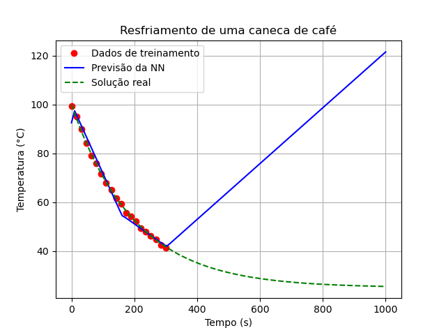
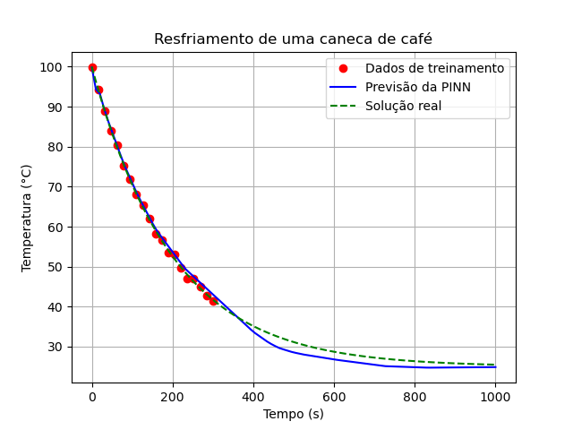

# Atividade 4

## Physics Informed Neural Networks (PINNs)

Redes Neurais Informadas por Física (PINNs) vão além de regressões e classificações tradicionais, e incorporam fundamentos de física no seu treinamento. Em geral, são projetadas para resolver problemas de equações diferenciais parciais (PDEs) e sistemas dinâmicos regidos por uma equação conhecida, mas de solução desconhecida. O treinamento de uma PINN envolve a minimização de uma função de perda que combina:

1. Dados conhecidos (se disponíveis): dados experimentais ou simulações que fornecem informações sobre o sistema.
2. Restrições físicas: resíduo das equações diferenciais que descrevem o comportamento do sistema.
3. Condições de contorno: condições iniciais e de contorno que devem ser satisfeitas pela solução.

A primeira condição é a minimização do **erro dos dados**, que já usamos nas regressões tradicionais. A segunda e a terceira são as **restrições físicas**. Estas três condições são combinadas em uma função de perda total, que é minimizada durante o treinamento da rede neural. O resultado é uma rede neural que não apenas se ajusta aos dados, mas também respeita as leis da física. Consequentemente, é capaz de extrapolar os dados.

## Exercício 1

1. Neste exercício, resolvemos analiticamente a EDO do resfriamento de uma caneca de café:

```math
   \frac{dT}{dt} = r(T_{amb} - T)
```
onde $T$ é a temperatura do café, $T_{amb} = 25$ ºC é a temperatura ambiente e $r = 0.005$ 1/s é uma taxa de resfriamento.

E depois resolvemos a mesma EDO usando o método de **Runge-Kutta** de quarta ordem (RK4), a partir do comando `scipy.integrate.solve_ivp`. Os resultados das duas foram bem próximos, como podemos ver na imagem abaixo:

 * Comparação entre a solução analítica e o método de Runge-Kutta:


O código desenvolvido para essa primeira parte foi: [Runge Kutta Scipy](Runge-Kutta-Scipy.py)

2. Depois geramos dados sintéticos para treinar a NN e fizemos a interpolação da função do resfriamento, da mesma forma como interpolamos a função seno na atividade anterior. O resultado foi o seguinte:

 * Interpolação da função do resfriamento:


Alteramos os dados para ver se a NN conseguiria prever o resfriamento quando extrapolado o intervalo de treinamento. E o resultado foi esse:

 * Previsão da NN:


Ou seja, a Rede Neural não conseguiu prever o comportamento físico real. Essa parte foi desenvolvida no código: [NN sem PINN](NN-normal.py)

3. Então, para melhorar os resultados, implementamos uma PINN incluindo as restrições físicas na minimização da perda, mas assumindo que conhecemos o valor da taxa $r = 0.005$ 1/s. O resultado foi bem melhor, como pode ser visto na imagem abaixo:

 * Previsão da PINN:


Logo, podemos concluir que ... O código dessa parte está em: [PINN](PINN.py)

4. Por fim, implementamos a PINN sem conhecer o valor da taxa $r$. A rede deve ser capaz de descobrir o valor correto. Compare com a solução analítica e com a NN de regressão simples.


## Exercício 2