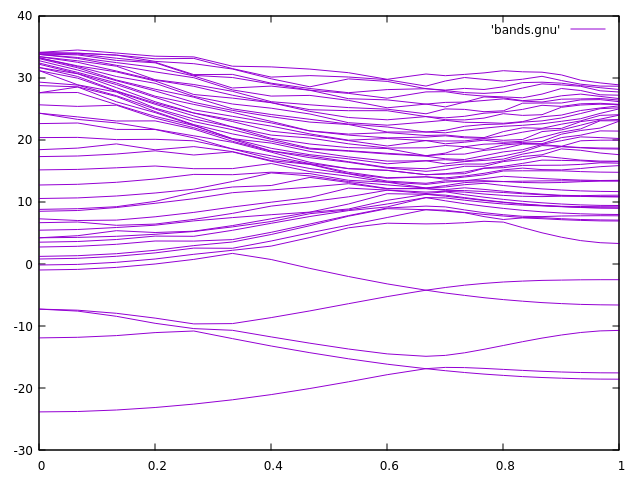

# Atividade 5

Essa atividade foi desenvolvida para aprendermos a compilar o **Quantum Espresso** e resolver um problema simples das bandas do grafeno, a partir de dados disponibilizados publicamente. O Quantum Espresso é um conjunto integrado de algoritmos computacionais de código aberto para cálculos de estrutura eletrônica e modelagem de materiais em nanoescala. Baseia-se na teoria do funcional da densidade (DFT), ondas planas e pseudopotenciais. 

Para isso, tivemos que aprender a usar o terminal no Linux para compilar e rodar o algoritmo.

## Entendendo o processo de compilação

1. **Compilação simples**

Para compilar e executar um programa C simples (`pi.c`):

```bash
# Compilar
$ gcc pi.c -o pi.out
# Executar
$ ./pi.out
```

2. **Usando mais de um arquivo .c**

Se tentar compilar apenas `main.c`:

```bash
$ gcc main.c -o main.out
```
Provavelmente ocorrerá erro de símbolo indefinido, pois funções implementadas em `biblioteca.c` não estarão presentes.

Para compilar e linkar ambos arquivos:

```bash
$ gcc main.c biblioteca.c -o quadrado1.out
$ ./quadrado1.out
```

3. **Compilando como biblioteca estática**

Crie uma biblioteca estática para reutilizar código:

```bash
# Compila o objeto
$ gcc -c biblioteca.c -o biblioteca.o
# Agrupa em biblioteca estática
$ ar rcs libbiblioteca.a biblioteca.o
# Compila main e linka com a biblioteca
$ gcc main.c -L. -lbiblioteca -o quadrado2.out
# Executa
$ ./quadrado2.out
```

4. **Compilando como biblioteca dinâmica**

Bibliotecas dinâmicas permitem atualização sem recompilar o programa principal:

```bash
# Compila objeto
$ gcc -c biblioteca.c -o biblioteca.o
# Cria biblioteca dinâmica
$ gcc -shared -o libbiblioteca.so biblioteca.o
# Compila main e linka com a biblioteca
$ gcc main.c -L. -lbiblioteca -o quadrado3.out
# Tente executar
$ ./quadrado3.out
# Se der erro de biblioteca não encontrada, defina o caminho:
$ export LD_LIBRARY_PATH=.
# Tente novamente
$ ./quadrado3.out
```

# Usando make e Makefile

O `make` automatiza a compilação com regras definidas em um arquivo `Makefile`. Exemplo:

```makefile
# Makefile simples
all: quadrado2.out quadrado3.out

quadrado2.out: main.c libbiblioteca.a
	gcc main.c -L. -lbiblioteca -o quadrado2.out

libbiblioteca.a: biblioteca.o
	ar rcs libbiblioteca.a biblioteca.o

biblioteca.o: biblioteca.c
	gcc -c biblioteca.c -o biblioteca.o

quadrado3.out: main.c libbiblioteca.so
	gcc main.c -L. -lbiblioteca -o quadrado3.out

libbiblioteca.so: biblioteca.o
	gcc -shared -o libbiblioteca.so biblioteca.o

clean:
	rm -f *.o *.a *.so quadrado2.out quadrado3.out
```

Para compilar:
```bash
make
```
Para limpar:
```bash
make clean
```

# Usando autoconf

O `autoconf` gera scripts de configuração portáveis. Passos básicos:
1. Crie `configure.ac`:
   ```m4
   AC_INIT([quadrado], [1.0])
   AM_INIT_AUTOMAKE
   AC_PROG_CC
   AC_CONFIG_FILES([Makefile])
   AC_OUTPUT
   ```
2. Crie `Makefile.am`:
   ```makefile
   bin_PROGRAMS = quadrado2.out
   quadrado2_out_SOURCES = main.c biblioteca.c
   ```
3. Gere e rode os scripts:
   ```bash
   autoreconf -i
   ./configure
   make
   ```

# Usando cmake

O `cmake` é uma ferramenta moderna para projetos multiplataforma. Exemplo de `CMakeLists.txt`:
```cmake
cmake_minimum_required(VERSION 3.0)
project(quadrado)

add_library(biblioteca STATIC biblioteca.c)
add_executable(quadrado2.out main.c)
target_link_libraries(quadrado2.out biblioteca)

add_library(biblioteca_shared SHARED biblioteca.c)
add_executable(quadrado3.out main.c)
target_link_libraries(quadrado3.out biblioteca_shared)
```
Para compilar:
```bash
mkdir build
cd build
cmake ..
make
```
Essas ferramentas facilitam a automação e portabilidade da compilação dos seus projetos C.

# Resultado

Rodamos um exemplo bem simples, com pouco parâmetros, só para entender o funcionamento do código. Nele, conseguimos ver o **Cone de Dirac**, que descreve uma característica específica na estrutura de bandas eletrônicas de certos materiais, como o grafeno. Esses cones representam pontos onde as bandas de valência e condução se encontram, formando um ponto de Dirac, e a energia em torno desse ponto varia linearmente, lembrando a forma de um cone. A imagem gerada pelo código foi:



