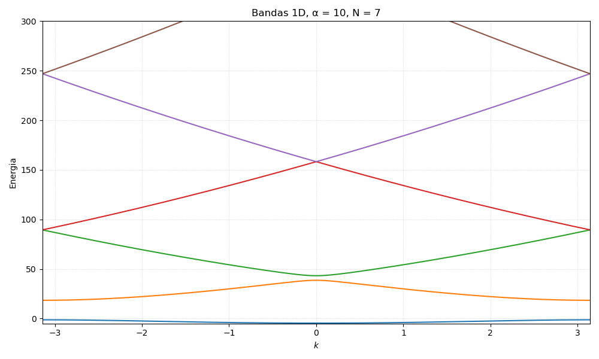
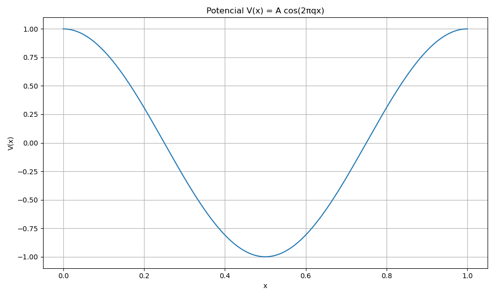
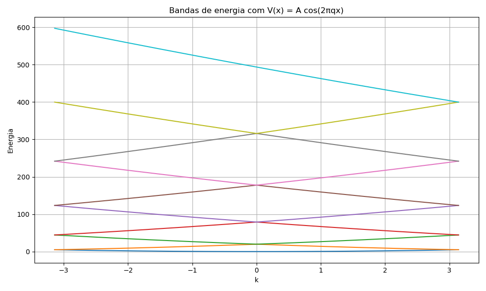

# Atividade 6

Nesta atividade iremos calcular a estrutura de bandas de materiais resolvendo a equação de Schrödinger com uma expansão da função de Bloch no espaço k. Como fonte bibliográfica, pegamos o material do [Prof. Dr. Rodrigo Capaz](https://www.if.ufrj.br/~capaz/fmc/cap5-eletrons.pdf#page=21.08)

## Equação central

Considere a equação de Schrödinger para um potencial periódico $V(\vec{r}+\vec{R}) = V(\vec{r})$, sendo $\vec{R}$ um vetor da rede cristalina,

$$\left[\dfrac{p^2}{2m} + V(\vec{r})\right]\psi(\vec{r}) = E \psi(\vec{r})$$

O teorema de Bloch nos diz que a periodicidade de $V(\vec{r})$ implica que a função de onda é periódica a menos de uma fase, i.e. $\psi(\vec{r}+\vec{R}) = e^{i\vec{k}\cdot\vec{R}}\psi(\vec{r})$, introduzindo o quasi-momento $\vec{k}$. Consequentemente, podemos escrever $\psi_{\vec{k}}(\vec{r}) = e^{i\vec{k}\cdot\vec{r}} u_{\vec{k}}(\vec{r})$, usando o quasi-momento para indexar as soluções de energia $E_{\vec{k}}$. Aqui $u_{\vec{k}}(\vec{r}) = u_{\vec{k}}(\vec{r}+\vec{R})$ é a parte periódica das funções Bloch.

Toda função periódica, como $V(\vec{r})$ e $u_{\vec{k}}(\vec{r})$, pode ser escrita como uma série de Fourier definida por vetores $\vec{G}$ tal que $\vec{G}\cdot\vec{R} = 2\pi n$, com $n$ inteiro. Tais vetores $\vec{G}$ definem a periodicidade do espaço recíproco $\vec{k}$ e a 1ª zona de Brillouin. Assim, podemos escrever

$$V(\vec{r}) = \sum_{\vec{G}'} V_{\vec{G}'} e^{i\vec{G}'\cdot\vec{r}}$$

$$u_{\vec{k}}(\vec{r}) = \sum_{\vec{G}} c(\vec{k}-\vec{G}) e^{-i\vec{G}\cdot\vec{r}}$$

$$\psi_{\vec{k}}(\vec{r}) = \sum_{\vec{G}} c(\vec{k}-\vec{G}) e^{i(\vec{k}-\vec{G})\cdot\vec{r}}$$

Substituindo estas definições na equação de Schrödinger e após manipulações simples, obtemos a **equação central**

$$\left[ \dfrac{\hbar^2}{2m}|\vec{k}-\vec{G}|^2 -E_{\vec{k}}\right]c(\vec{k}-\vec{G}) + \sum_{\vec{G}'} V_{\vec{G}'-\vec{G}} c(\vec{k}-\vec{G}') = 0$$

Note que a forma da equação central acima é equivalente a uma equação matricial, onde o primeiro termo $\lambda_{\vec{k}-\vec{G}} = \frac{\hbar^2}{2m}|\vec{k}-\vec{G}|^2$ compõe a diagonal e o segundo termo representa o produto de uma matriz $U_{\vec{G}'-\vec{G}}$, elemento da linha $\vec{G}'$ e coluna $\vec{G}$, por um vetor coluna $c(\vec{k}-\vec{G}')$, linha $\vec{G}'$. Assim, a equação central pode ser escrita como

```math
\begin{pmatrix}
\lambda_{\vec{k}-\vec{G_0}} + V_0 & V_{0,1} & V_{0,2} & \cdots
\\
V_{1,0} & \lambda_{\vec{k}-\vec{G_1}} + V_0 & V_{1,2} & \cdots
\\
V_{2,0} & V_{2,1} & \lambda_{\vec{k}-\vec{G_2}} + V_0 & \cdots
\\
\vdots & \vdots & \vdots & \ddots
\end{pmatrix}
\begin{pmatrix}
c(\vec{k} - \vec{G}_0)
\\
c(\vec{k} - \vec{G}_1)
\\
c(\vec{k} - \vec{G}_2)
\\
\vdots
\end{pmatrix}
= E_{\vec{k}}
\begin{pmatrix}
c(\vec{k} - \vec{G}_0)
\\
c(\vec{k} - \vec{G}_1)
\\
c(\vec{k} - \vec{G}_2)
\\
\vdots
\end{pmatrix}
```

onde $V_{i,j} = V_{\vec{G}_i-\vec{G}_j}$. A matriz à esquerda é o Hamiltoniano na representação matricial da base de ondas planas.

## Exercício 1 - Caso 1D simples

Vamos considerar unidades atômicas, tal que $\hbar = 2m = 1$. Tal que $\lambda_{k-G} = |k-G|^2$ fica mais simples. Considere que o potencial tem periodicidade $R = 1$, tal que $G_n = 2\pi n$ e a primeira Zona de Brillouin fica definida no intervalo $-\pi < k \leq \pi$. Por fim, considere apenas acoplamentos entre ondas planas suscessivas, tal que $V_0 = 0$ e $V_{i,j} = \alpha \delta_{i,j\pm 1}$, sendo $\alpha$ uma constante que define a intensidade do potencial.

Verifique que nestas condições o Hamiltoniano da **equação central** fica **tridiagonal**

$$
H(k) = 
\begin{pmatrix}
\lambda_{\vec{k}-\vec{G_1}} - E_{\vec{k}} & \alpha & 0 & \cdots
\\
\alpha & \lambda_{\vec{k}-\vec{G_2}} - E_{\vec{k}} & \alpha & \cdots
\\
0 & \alpha & \lambda_{\vec{k}-\vec{G_3}} - E_{\vec{k}} & \cdots
\\
\vdots & \vdots & \vdots & \ddots
\end{pmatrix}
$$

Fizemos, então, um código que diagonalize este Hamiltoniano para k no intervalo da 1ª zona de Brillouin, escolhendo e variando o valor de $\alpha$ e o número de ondas planas ($G$). O gráfico das bandas gerado para esse caso foi:




## Exercício 2 - Caso 1D com V(x)

Escolhemos uma função para $V(x)$ que respeite $V(x) = V(x+R)$ com $R=1$: $V(x) = A \cos(2\pi q x)$



Depois, construimos os termos do potencial na equação central via:

$$V_{m,n} = \int_0^1 V(x)e^{-i G_{m,n}x}dx = \int_0^1 V(x)e^{-i 2\pi(m-n)x}dx$$

E calculamos as bandas para esta nova matriz $V_{m,n}$. O resultado foi o seguinte:

